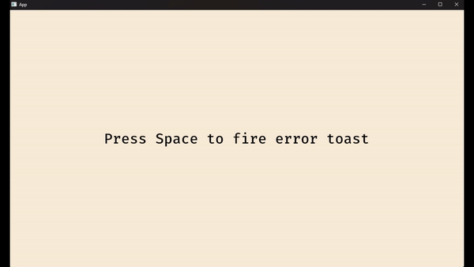

# bevy_anyhow_alert

[](https://crates.io/crates/bevy_anyhow_alert)
[](https://docs.rs/bevy_anyhow_alert/latest/)

This crate offers an extension trait for systems that helps with system- and application-level error management in Bevy. Mildly configurable using the re-export of `bevy_ui_mod_alerts`. The main benefit: your systems can return `anyhow::Result` (or even `Result<T, Vec<anyhow::Error>>`)!



## How To Use

When writing your systems, return one of the two accepted types:

- `bevy_anyhow_alert::Result<T>`: a re-export of `anyhow::Result<T>`
- `bevy_anyhow_alert::ResultVec<T>`: an alias for `Result<T, Vec<anyhow::Error>>`

Then call `my_system.anyhow_alert()`! When it errors, you'll see toasts fire (don't forget a camera).

```rust
let mut app = App::new();
// ...
app.add_system(fire_error.anyhow_alert());
// ..
app.run();
```

Feel free to define whatever types of errors your want throughout your application. When returning errors, the error is wrapped in an `anyhow::Error` with `anyhow::Error::new(MyError)`. This is especially easy if you derive `thiserror::Error` on your Error type.

```rust
#[derive(Debug, Error)]
#[error("testing!")]
pub struct MyError;

fn fire_error(inputs: Res<ButtonInput<KeyCode>>) -> anyhow::Result<()> {
    if inputs.just_pressed(KeyCode::Space) {
        Err(anyhow::Error::new(MyError))
    } else {
        Ok(())
    }
}
```
